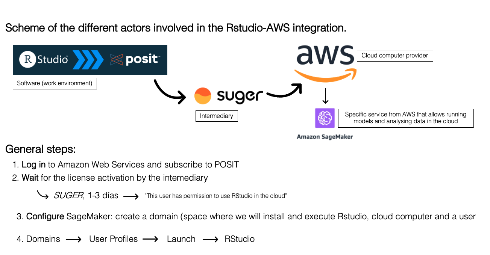

# AmazonSageMakerTutorial

# Full AWS SageMaker RStudio Setup Protocol

This markdown provides the complete reproducible sequence, from login to launching RStudio. All in a single script format for AWS CloudShell.The domain creation part can be done from AWS click by click, and then I recommend doing the R-enabling part by following the steps here. Before starting this, make sure to have a valid RStudio license, which is provided by POSIT via SUGER. It can take from 24 to 48 hours and they notify you by email. 


---

```bash
# ===============================
# STEP 1 — Login and Environment
# ===============================
export REGION="us-east-1"
aws sts get-caller-identity

# ===============================
# STEP 2 — Define Configuration
# ===============================
DOMAIN_NAME="RStudioDomain-$(date +%Y%m%d%H%M)"
ROLE_NAME="SageMakerRStudioRole-$(date +%Y%m%d%H%M)"
USER_PROFILE_NAME="rstudio-user-$(date +%Y%m%d%H%M)"
VPC_ID="vpc-03f69d7fc668323c2"
SUBNET_IDS=("subnet-0a05f099e0064e6c3" "subnet-088cd70b304c984e4")
ACCOUNT_ID=$(aws sts get-caller-identity --query Account --output text)

echo "Account: $ACCOUNT_ID"
echo "Domain name: $DOMAIN_NAME"

# ===============================
# STEP 3 — Create IAM Role
# ===============================
aws iam create-role \
  --role-name $ROLE_NAME \
  --assume-role-policy-document '{
    "Version": "2012-10-17",
    "Statement": [
      {
        "Effect": "Allow",
        "Principal": { "Service": "sagemaker.amazonaws.com" },
        "Action": "sts:AssumeRole"
      }
    ]
  }' || echo "Role may already exist, continuing..."

# Attach required policies
aws iam attach-role-policy --role-name "$ROLE_NAME" --policy-arn arn:aws:iam::aws:policy/AmazonSageMakerFullAccess
aws iam attach-role-policy --role-name "$ROLE_NAME" --policy-arn arn:aws:iam::aws:policy/AmazonS3FullAccess
aws iam attach-role-policy --role-name "$ROLE_NAME" --policy-arn arn:aws:iam::aws:policy/AWSLicenseManagerUserAccess

# Get Role ARN
ROLE_ARN="arn:aws:iam::${ACCOUNT_ID}:role/${ROLE_NAME}"
echo "IAM Role ARN: $ROLE_ARN"

# ===============================
# STEP 4 — Create SageMaker Domain
# ===============================
aws sagemaker create-domain \
  --region $REGION \
  --domain-name $DOMAIN_NAME \
  --auth-mode IAM \
  --default-user-settings "ExecutionRole=${ROLE_ARN}" \
  --vpc-id $VPC_ID \
  --subnet-ids ${SUBNET_IDS[@]} \
  --app-network-access-type PublicInternetOnly

echo "⏳ Waiting for domain to reach status 'Ready'..."
sleep 120
aws sagemaker list-domains --region $REGION

# ===============================
# STEP 5 — Get Domain Information
# ===============================
aws sagemaker describe-domain \
  --region $REGION \
  --domain-id <DOMAIN_ID>

# ===============================
# STEP 6 — Get Security Groups
# ===============================
aws ec2 describe-security-groups \
  --filters "Name=vpc-id,Values=$VPC_ID" \
  --query "SecurityGroups[*].{Name:GroupName,Id:GroupId}" \
  --output table

# ===============================
# STEP 7 — Update User Profile
# ===============================
aws sagemaker list-user-profiles \
  --region $REGION \
  --domain-id-equals <DOMAIN_ID>

aws sagemaker update-user-profile \
  --region $REGION \
  --domain-id <DOMAIN_ID> \
  --user-profile-name <USER_PROFILE> \
  --user-settings "{\"SecurityGroups\": [\"<INBOUND_SG>\", \"<OUTBOUND_SG>\"]}"

# ===============================
# STEP 8 — Enable RStudio
# ===============================
aws sagemaker update-domain \
  --region $REGION \
  --domain-id <DOMAIN_ID> \
  --domain-settings-for-update RStudioServerProDomainSettingsForUpdate={DomainExecutionRoleArn=$ROLE_ARN} \
  --default-user-settings "{\"SecurityGroups\": [\"<INBOUND_SG>\", \"<OUTBOUND_SG>\"]}"

aws sagemaker describe-domain \
  --region $REGION \
  --domain-id <DOMAIN_ID>

# ===============================
# STEP 9 — Enable RStudio for User
# ===============================
aws sagemaker update-user-profile \
  --region $REGION \
  --domain-id <DOMAIN_ID> \
  --user-profile-name <USER_PROFILE> \
  --user-settings "{\"RStudioServerProAppSettings\": {\"AccessStatus\": \"ENABLED\"}}"

# ===============================
# STEP 10 — Launch RStudio
# ===============================
# Go to: https://console.aws.amazon.com/sagemaker/
# Navigate to "Domains" → Select your domain → "Launch app" → RStudio

# ===============================
# STEP 11 — (Optional) Delete Domain
# ===============================
aws sagemaker delete-domain \
  --region $REGION \
  --domain-id <DOMAIN_ID> \
  --retain-deployment-data false \
  --retention-policy HomeEfsFileSystem=Delete
```

## Connecting SageMaker to GitHub via SSH
To connect your SageMaker RStudio environment to GitHub securely, follow these steps.

1. Generate a new SSH key inside SageMaker
```bash
ssh-keygen -t ed25519 -C "jazelouled-cheikhbonan@sagemaker"
```

Press Enter to save in the default location:
```bash
# /home/sagemaker-user/.ssh/id_ed25519
```
You can leave the passphrase empty if preferred.

2. Display the public key
```bash
cat ~/.ssh/id_ed25519.pub
```

```
Copy the entire key that starts with ssh-ed25519.

3. Add the key to GitHub
	1.	Go to GitHub → Settings → SSH and GPG keys → New SSH key
	2.	Title: SageMaker
	3.	Paste the public key you copied
	4.	Click Add SSH key
	
	
4. Test the connection
Run this command in your SageMaker terminal to verify that everything works:

```bash
ssh -T git@github.com
```

Expected output:

```bash
Hi jazelouled! You've successfully authenticated, but GitHub does not provide shell access.
```
5. Clone or push to a repository using SSH
```bash
# Clone your repository
git clone git@github.com:jazelouled/AmazonSageMakerTutorial.git

# Move into the repo
cd AmazonSageMakerTutorial

# Commit and push changes
git add .
git commit -m "update README with SSH setup"
git push origin main
```


## Troubleshooting: installing "terra" in SageMaker

If you get the error  
`fatal error: proj.h: No such file or directory` while installing `terra`, it means PROJ headers are missing.  
Run the following commands in your terminal:

```bash
# 1. Remove old PROJ versions
sudo apt-get remove -y libproj-dev proj-bin proj-data

# 2. Install dependencies for building from source
sudo apt-get update -y
sudo apt-get install -y build-essential cmake sqlite3 libsqlite3-dev curl

# 3. Download and install PROJ (modern version, with proj.h)
cd /tmp
wget https://download.osgeo.org/proj/proj-9.1.0.tar.gz
tar -xzf proj-9.1.0.tar.gz
cd proj-9.1.0
mkdir build && cd build
cmake .. && make -j$(nproc)
sudo make install

# 4. Verify that proj.h now exists
ls /usr/local/include/proj.h
proj

